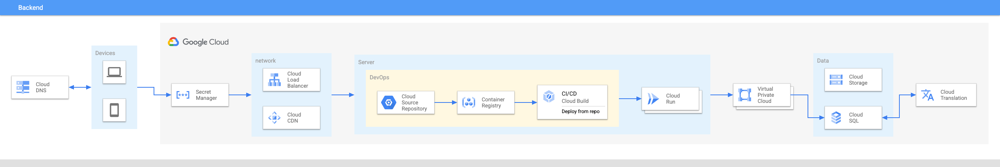

# Build a social media with Google Cloud

This repo will help you create an end-to-end social media web app with Google Cloud and Terraform


## Install
You can install this application using the `Open in Google Cloud Shell` button 
below. 

<a href="https://ssh.cloud.google.com/cloudshell/editor?cloudshell_git_repo=https://github.com/chrislevn/pet-social-media-django-gcp&shellonly=true&cloudshell_image=gcr.io/ds-artifacts-cloudshell/deploystack_custom_image" target="_new">
    
</a>

Clicking this link will take you right to the DeployStack app, running in your 
Cloud Shell environment. It will walk you through setting up your architecture.  

## Cleanup 
To remove all billing components from the project
1. Remove componets with terraform apply -auto-approve -var=project=${PROJECT}
2. Typing `deploystack uninstall`

## How to run 
1. Create project with billing enabled, and configure gcloud for that project

   ```
   PROJECT_ID=foobar
   gcloud config set project $PROJECT_ID
   ```

2. Configure default credentials (allows Terraform to apply changes):

   ```
   gcloud auth application-default login
   ```

3. Enable base services:

   ```
   gcloud services enable \
     cloudbuild.googleapis.com \
     run.googleapis.com \
     vpcaccess.googleapis.com
   ```

4. Build base image

   ```
   gcloud builds submit
   ```

5. Apply Terraform

   ```
   terraform init
   terraform apply -var=project=${PROJECT_ID} -auto-approve
   ```

   Check the output url from Cloud Run

Run locally

Run ``PRODUCTION_MODE="production" python3 manage.py runserver --insecure 0.0.0.0:8080``

This is not an official Google product.
